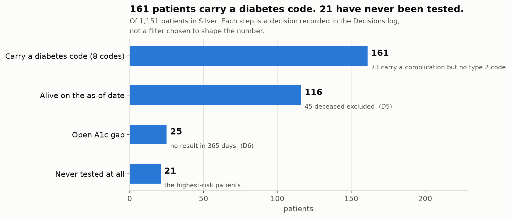
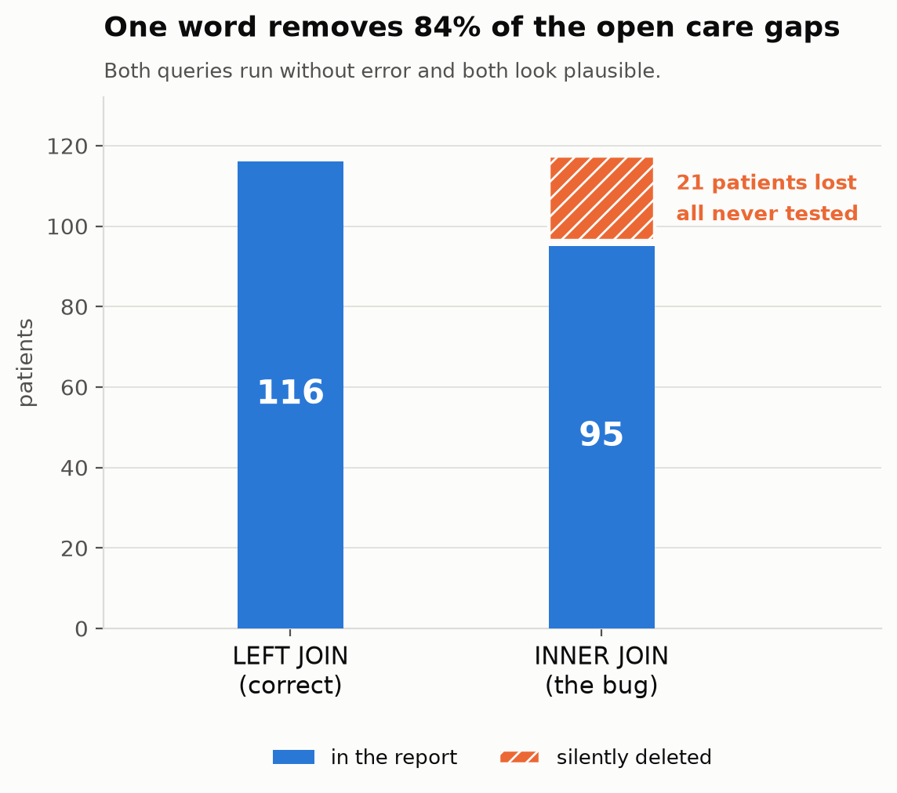

# Clinical Care Gap Explorer

Finds diabetic patients overdue for an A1c test — and shows the data quality work
required before that list can be trusted.

**Live demo:** https://franklin0603.github.io/clinical-care-gap-explorer/
**Synthetic data only (Synthea). No PHI.**

---

## The question

Which diabetic patients have not had an A1c result in the last 12 months? It
mirrors a real quality measure (HEDIS-style comprehensive diabetes care) and is
the kind of list a care team acts on directly.

**Result: 25 of 116 diabetic patients have an open A1c gap (21.6%). 21 of them
have never been tested at all.**

Those 21 are the same people three different, ordinary technical mistakes would
each have hidden — see [FINDINGS.md](docs/FINDINGS.md).



## Why the middle matters

The query is easy. Trusting it is not. I deliberately injected six classes of
defect that occur in real clinical data — duplicate encounters from interface
replays, unit errors where mg/dL lands in a percentage field, patients registered
twice under different MRNs — and built the validation layer that catches them.

**Catch rate: 6 of 6 defect types (100%); 249 of 249 injected rows, each caught
by the check meant for it.**

Rejected rows are quarantined with a reason, never dropped. Suspected duplicate
patients are flagged for human review, never auto-merged — a wrong merge combines
two people's medication lists. On every table, `bronze = silver + quarantine`
balances, and the pipeline stops if it does not.

## The bug worth knowing about

The highest-risk person on a care-gap list is the diabetic with no A1c on record.
An inner join from the cohort to observations deletes exactly those people, and
nothing errors.



## Architecture

Synthea → DuckDB → Bronze → Silver (validated) → Gold (`care_gap_a1c`) → Next.js

| Layer | Rows |
|-------|------|
| Bronze | 1,039,548 across five tables |
| Silver | 1,039,325 |
| Quarantined | 223 |
| Remediated | 20 |
| Gold cohort | 116 |

## Cohort definitions

**Diabetic patient (D5):** any of eight diabetes SNOMED codes ever recorded, on a
patient alive on the as-of date. Not just the type 2 code — 73 patients carry a
diabetic complication with no underlying diagnosis code, and anchoring on one code
drops 45% of the cohort.

**Open A1c gap (D6):** no A1c result (LOINC `4548-4`, numeric, on or before the
as-of date) in the 365 days before it. Never tested is a gap. Ordered-but-not-
resulted is not observable in this data and is counted the same as never ordered
— stated rather than hidden.

Full reasoning: [DATA_DICTIONARY.md](docs/DATA_DICTIONARY.md).

## Pages

1. **Overview** — the headline number and how it was reached
2. **Pipeline & Data Quality** — layer counts, six checks, quarantine, identity review queue
3. **Patient Care** — the cohort, scoped by clinical role (PCT / Nurse / Physician)
4. **Ask the Data** — natural language → SQL, generated SQL always shown *(Day 7)*

## Access by role

Access is scoped to the **minimum necessary** for each clinical role. This is not
HIPAA compliance — it is a model of the access-scoping principle. There is no
authentication; the role selector is a demonstration control.

| Role | Patients | Columns | Scope |
|------|---------:|--------:|-------|
| Patient Care Technician | 70 | 7 | One assigned unit |
| Nurse | 106 | 17 | Their service line |
| Physician | 116 | 19 | Cross-unit, whole panel |

**The filtering is in the query layer, not the component.** The site is a static
export, so there is no request-time server; instead the pipeline writes one
payload per role, each built by SQL that never selects the restricted columns and
never returns out-of-unit rows. The PCT's file contains no A1c value anywhere —
the fields are absent, not blanked, not hidden in CSS. Row counts change with
role as well as columns.

**Column filtering alone would still leak.** `next_due_date` is the last A1c date
plus 365 days and `days_overdue` is the same date in different clothes, so
withholding the value while keeping either one reconstructs the test date
exactly. Derived columns are restricted alongside what they derive from — see
[`pipeline/access.py`](pipeline/access.py).

**What it does not do:** with no authentication, every role's file is reachable
by anyone who guesses the URL. In a real system the same queries would sit behind
a session and an authorization check. What is being demonstrated is where the
restriction lives.

The matrix draws on my time as a patient care technician: a PCT sees who needs a
task done and when the patient was last in, not what the result was.

## Run it

```bash
python -m venv .venv && source .venv/bin/activate
pip install -r requirements.txt

# generate, load, corrupt, validate, build Gold — one command
python pipeline/run_all.py --generate
```

Without `--generate` it rebuilds the warehouse from an existing `data/raw` in
about 13 seconds. Synthea generation needs Java 17 and takes ~4 minutes; the jar
is downloaded separately and is gitignored.

Reproducibility depends on four pinned flags, not one — `-s` alone gave different
data four weeks later. See D2 in [DAY_1_DECISIONS.md](docs/DAY_1_DECISIONS.md).

## Repo map

| Path | What |
|------|------|
| `pipeline/` | `load_bronze` → `corrupt` → `validate` → `gold`, plus `run_all` |
| `pipeline/day*.ipynb` | Each stage prototyped with visible output before being ported |
| `docs/FINDINGS.md` | Seven findings from building it — start here |
| `docs/DATA_DICTIONARY.md` | Tables, columns, code systems, cohort definitions |
| `docs/DATA_QUALITY_SPEC.md` | The six defects and the six checks |
| `docs/CLINICAL_CONCEPTS.md` | Plain-English primer for non-healthcare readers |
| `build-plan/` | The seven-day plan, decisions log, and validation gates |

## Not in scope

Clinical notes and NLP extraction, insurance claims, FHIR/OMOP conformance, real
authentication, cloud deployment. Each is a separate project rather than a thin
addition to this one.

## What this cannot tell you

Synthea patients are fictional and their care is more diligent than real
populations. No orders table, so ordered-but-not-resulted is invisible. No phone
or email, so "can we reach them" has no answer here. The defects are the ones I
injected, so the catch rate measures the checks against my own defect list, not
against reality.
