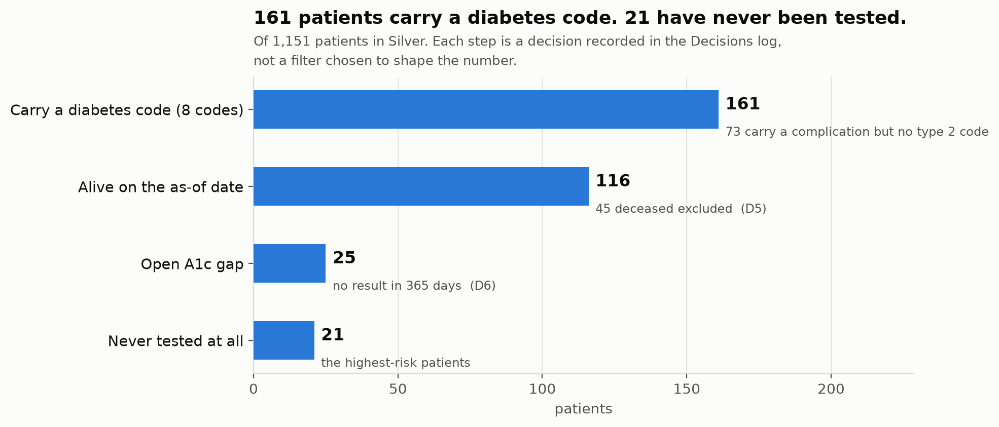
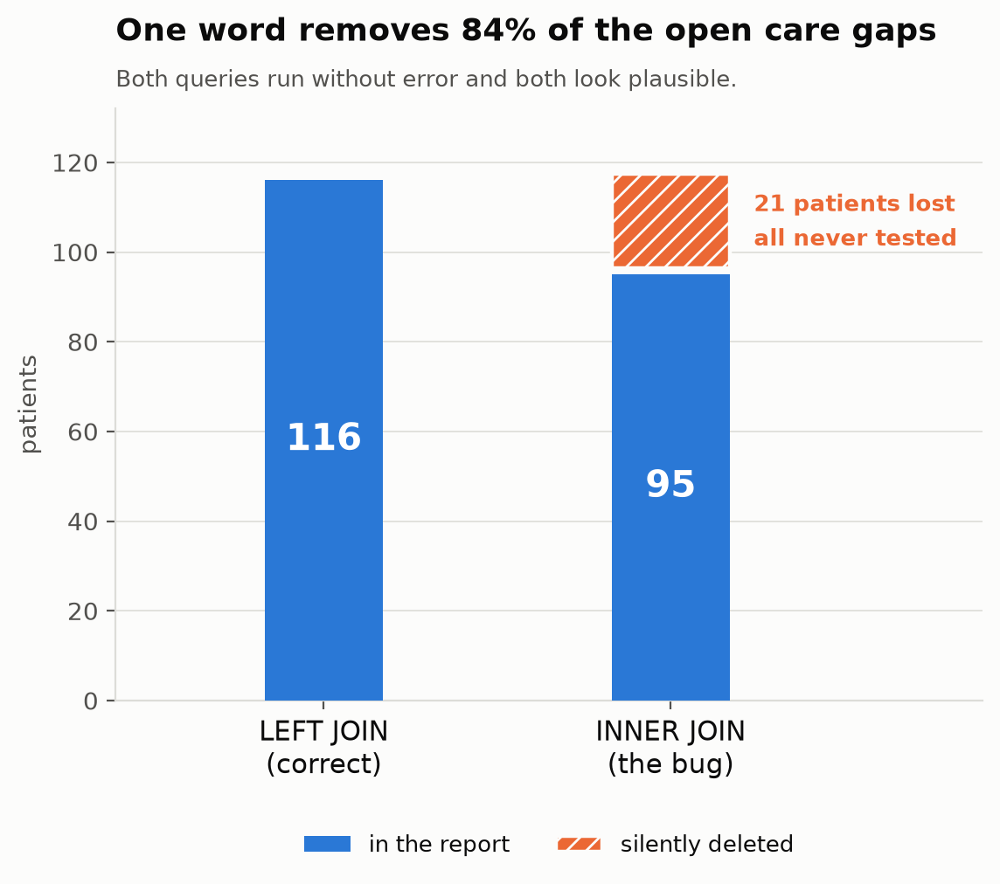

# Clinical Care Gap Explorer

Finds diabetic patients overdue for an A1c test — and shows the data quality work
required before that list can be trusted.

**Live demo:** https://franklin0603.github.io/clinical-care-gap-explorer/
**Synthetic data only (Synthea). No PHI.**

---

## The question

Which diabetic patients have not had an A1c result in the last 12 months? It
mirrors a real quality measure (HEDIS-style comprehensive diabetes care) and is
the kind of list a care team acts on directly.

**Result: 25 of 116 diabetic patients have an open A1c gap (21.6%). 21 of them
have never been tested at all.**

Those 21 are the same people three different, ordinary technical mistakes would
each have hidden — see [FINDINGS.md](docs/FINDINGS.md).



## Why the middle matters

The query is easy. Trusting it is not. I deliberately injected six classes of
defect that occur in real clinical data — duplicate encounters from interface
replays, unit errors where mg/dL lands in a percentage field, patients registered
twice under different MRNs — and built the validation layer that catches them.

**Catch rate: 6 of 6 defect types (100%); 249 of 249 injected rows, each caught
by the check meant for it.**

Rejected rows are quarantined with a reason, never dropped. Suspected duplicate
patients are flagged for human review, never auto-merged — a wrong merge combines
two people's medication lists. On every table, `bronze = silver + quarantine`
balances, and the pipeline stops if it does not.

## The bug worth knowing about

The highest-risk person on a care-gap list is the diabetic with no A1c on record.
An inner join from the cohort to observations deletes exactly those people, and
nothing errors.



## Architecture

Synthea → DuckDB → Bronze → Silver (validated) → Gold (`care_gap_a1c`) → Next.js

| Layer | Rows |
|-------|------|
| Bronze | 1,039,548 across five tables |
| Silver | 1,039,325 |
| Quarantined | 223 |
| Remediated | 20 |
| Gold cohort | 116 |

## Cohort definitions

**Diabetic patient (D5):** any of eight diabetes SNOMED codes ever recorded, on a
patient alive on the as-of date. Not just the type 2 code — 73 patients carry a
diabetic complication with no underlying diagnosis code, and anchoring on one code
drops 45% of the cohort.

**Open A1c gap (D6):** no A1c result (LOINC `4548-4`, numeric, on or before the
as-of date) in the 365 days before it. Never tested is a gap. Ordered-but-not-
resulted is not observable in this data and is counted the same as never ordered
— stated rather than hidden.

Full reasoning: [DATA_DICTIONARY.md](docs/DATA_DICTIONARY.md).

## Pages

1. **Overview** — the headline number and how it was reached
2. **Pipeline & Data Quality** — layer counts, six checks, quarantine, identity review queue
3. **Patient Care** — the cohort, scoped by clinical role (PCT / Nurse / Physician)
4. **Ask the Data** — ten preset questions over Gold, the SQL shown above every answer, executed in the browser with DuckDB-WASM. Single SELECT only.

## Access by role

Access is scoped to the **minimum necessary** for each clinical role. This is not
HIPAA compliance — it is a model of the access-scoping principle. There is no
authentication; the role selector is a demonstration control.

| Role | Patients | Columns | Scope |
|------|---------:|--------:|-------|
| Patient Care Technician | 70 | 7 | One assigned unit |
| Nurse | 106 | 17 | Their service line |
| Physician | 116 | 19 | Cross-unit, whole panel |

**The filtering is in the query layer, not the component.** The site is a static
export, so there is no request-time server; instead the pipeline writes one
payload per role, each built by SQL that never selects the restricted columns and
never returns out-of-unit rows. The PCT's file contains no A1c value anywhere —
the fields are absent, not blanked, not hidden in CSS. Row counts change with
role as well as columns.

**Column filtering alone would still leak.** `next_due_date` is the last A1c date
plus 365 days and `days_overdue` is the same date in different clothes, so
withholding the value while keeping either one reconstructs the test date
exactly. Derived columns are restricted alongside what they derive from — see
[`pipeline/access.py`](pipeline/access.py).

**What it does not do:** with no authentication, every role's file is reachable
by anyone who guesses the URL. In a real system the same queries would sit behind
a session and an authorization check. What is being demonstrated is where the
restriction lives.

The matrix draws on my time as a patient care technician: a PCT sees who needs a
task done and when the patient was last in, not what the result was.

## Run it

```bash
python -m venv .venv && source .venv/bin/activate
pip install -r requirements.txt

# generate, load, corrupt, validate, build Gold — one command
python pipeline/run_all.py --generate
```

`--generate` downloads the Synthea jar (~200 MB, once — it is a tool, not code,
so it is gitignored) and generates the patients. It needs **Java 17** and takes
about four minutes. Every run after that can drop the flag and rebuilds the
warehouse from `data/raw` in about thirteen seconds.

For the web app:

```bash
cd web && npm install && npm run dev
```

Reproducibility depends on four pinned flags, not one — `-s` alone gave different
data four weeks later. See D2 in [DAY_1_DECISIONS.md](docs/DAY_1_DECISIONS.md).

## Repo map

| Path | What |
|------|------|
| `pipeline/` | `load_bronze` → `corrupt` → `validate` → `gold`, plus `run_all` |
| `pipeline/day*.ipynb` | Each stage prototyped with visible output before being ported |
| `docs/FINDINGS.md` | Seven findings from building it — start here |
| `docs/DATA_DICTIONARY.md` | Tables, columns, code systems, cohort definitions |
| `docs/DATA_QUALITY_SPEC.md` | The six defects and the six checks |
| `docs/CLINICAL_CONCEPTS.md` | Plain-English primer for non-healthcare readers |
| `build-plan/` | The seven-day plan, decisions log, and validation gates |

## What I'd do differently at scale

Written from what this build actually ran into, not from a list of tools.

**Orchestration.** `run_all.py` is a linear script: no retries, no partial reruns,
no memory of what succeeded. `corrupt.py` reloads Bronze at the top to guarantee
idempotency, which is correct and costs four seconds — at a hundred times the
data it is indefensible. This wants Dagster or Airflow, with each stage an asset
that knows its own dependencies, so a failed check re-runs validation rather than
regenerating the source data.

**Checks as a test suite, not hand-rolled Python.** DQ1–DQ6 are functions I wrote.
They work, and they will rot: a check that lives away from the model it validates
does not get updated when the model changes. dbt tests or Great Expectations fix
that by putting the assertion beside the thing asserted. The trade-off I would be
accepting is real, though — neither framework routes failing rows anywhere. They
fail the build. The quarantine-with-a-reason pattern, which is the part of this
project I would least want to lose, would have to be rebuilt on top.

**Alert on drift, not absolutes.** The catch rate is 6 of 6 today. The number worth
paging someone about is not "quarantine exceeded 500 rows" — that either fires
every day or never — but "the quarantine rate moved more than two standard
deviations from its trailing thirty-day mean". Absolute thresholds are how alerting
gets muted.

**Partition Bronze by load date.** Every run is a full reload. At a million rows
that is four seconds and partitioning would have been a day spent for nothing; at
a hundred million it is the whole problem. The trigger to change is when a reload
stops fitting in the window between one day's extract and the next.

**Make quarantine reprocessable.** Right now it is a dead-letter queue: rows go in
and nothing comes out. In a real system somebody fixes the upstream interface and
those 150 orphan observations become resolvable. That needs a replay path, a
`resolved_at` column, and a decision about whether a replayed row re-enters Silver
under its original load date or today's.

**DuckDB is a single-node engine, and I hit its edge.** It allows one writer. A
notebook kernel holding the database blocks every script, which cost me two
interruptions this week — a papercut here, a hard constraint with more than one
person. It is an excellent analytical engine and a poor shared warehouse. Every
transform in this repo is SQL rather than pandas specifically so that the
migration to Snowflake, BigQuery or Databricks is a connection string and a
dialect pass, not a rewrite.

**Pin every source of nondeterminism, then assert on it.** Setting the random seed
was not enough: the generator's clinician seed, reference date and simulation end
date all defaulted to the wall clock, and the same command produced different data
four weeks later. At scale the fix is not only pinning them but asserting a content
hash in CI, so the next drift is caught by a build rather than by someone checking.

**The limit the catch rate cannot see.** It scores my checks against defects I
designed, so it measures coverage of my own imagination. Real data fails in ways
nobody wrote a rule for. The complement is distribution monitoring — alerting when
the A1c distribution shifts or a code's frequency halves — which catches the class
of problem a rule-based check structurally cannot.

## Not in scope

Clinical notes and NLP extraction, insurance claims, FHIR/OMOP conformance, real
authentication, cloud deployment. Each is a separate project rather than a thin
addition to this one.

## What this cannot tell you

Synthea patients are fictional and their care is more diligent than real
populations. No orders table, so ordered-but-not-resulted is invisible. No phone
or email, so "can we reach them" has no answer here. The defects are the ones I
injected, so the catch rate measures the checks against my own defect list, not
against reality.
